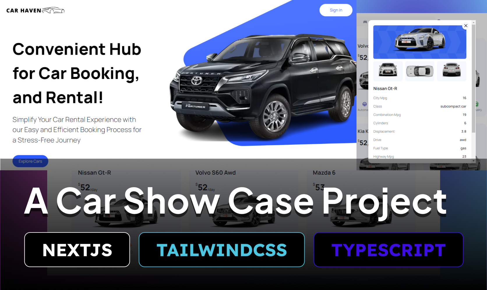
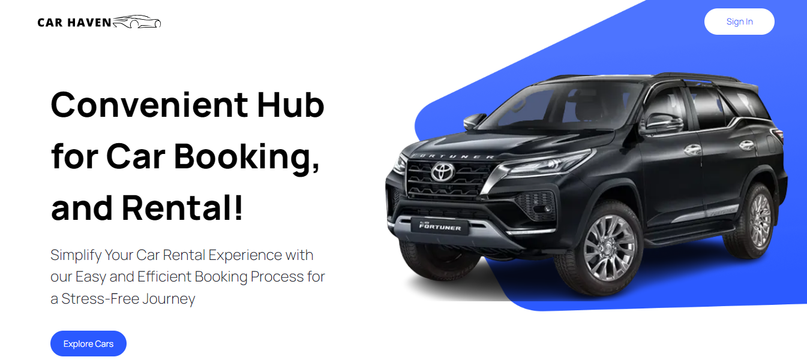
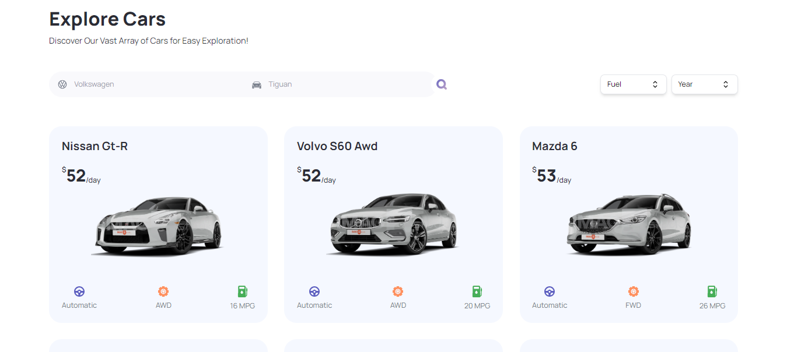
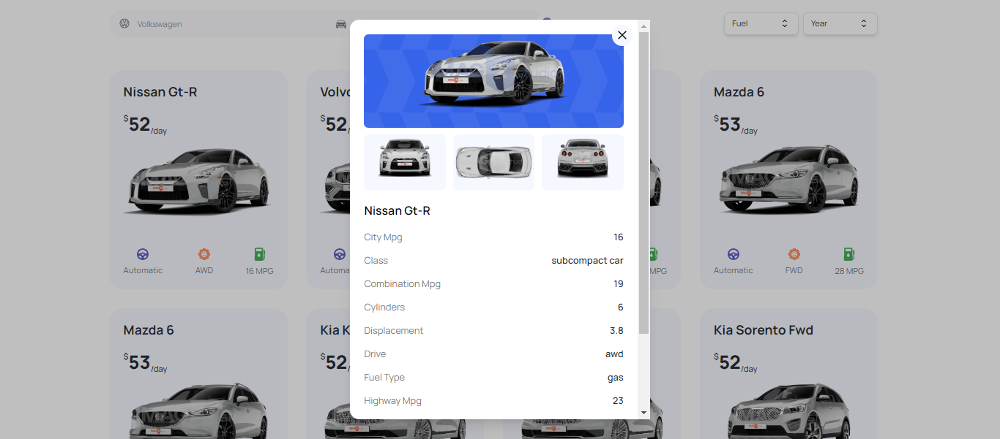

# 🚗 Car Haven - Explore Cars Around the World

Welcome to **Car Haven**, an interactive web application for car enthusiasts! Built using **Next.js 13** and deployed via **Vercel**, this app allows users to explore a wide variety of cars and filter them based on several criteria.

This project leverages **RapidAPI Cars API** to fetch real-time car data and images, ensuring that users get up-to-date information about cars from around the world.



<p align="center">
  <a href="https://car-haven-yoosufaathils-projects.vercel.app/" target="_blank">
    
  </a>
</p>

---

## 🌟 Features

- **Home Page**: A visually engaging home page that showcases a diverse range of cars fetched from the API.
- **Car Exploration**: Users can explore and filter cars based on criteria like model, manufacturer, year, fuel type, and make.
- **Server-Side Rendering**: Optimized performance through seamless transitions from client-side to server-side rendering.
- **Pagination**: Easily browse through a large dataset with a simple and intuitive pagination system.
- **SEO Optimization**: Metadata optimization to ensure better search engine rankings.
- **TypeScript Support**: Strong typing using TypeScript for enhanced code quality and development experience.
- **Responsive Design**: The app is fully responsive, providing an excellent experience across all devices.

---

## 🛠️ Technologies Used

- **Next.js 13**: Framework for server-rendered React applications.
- **React**: Library for building user interfaces.
- **Tailwind CSS**: Utility-first CSS framework for building custom designs.
- **TypeScript**: Type-safe language for modern web applications.
- **Headless UI**: Unstyled, fully accessible UI components.
- **RapidAPI Cars API**: A third-party API to fetch detailed information about cars.
- **Vercel**: Hosting and deployment platform.

---

## 📂 Project Structure

```
my-nextjs-app/
├── components/
│ ├── CarCard.tsx # Component to display a car card
│ ├── CarDetail.tsx # Component for detailed information of a car
│ ├── CustomFilter.tsx # Custom filtering component for cars
│ └── Header.tsx # Header component for the app
├── pages/
│ ├── api/
│ │ └── hello.ts # Example API route
│ ├── \_app.tsx # Custom App component to initialize pages
│ ├── index.tsx # Home page displaying car listings
│ └── cars.tsx # Page for browsing and filtering cars
├── public/
│ ├── images/
│ │ └── logo.png # Application logo
│ └── favicon.ico # Favicon for the app
├── styles/
│ ├── globals.css # Global CSS styles
│ └── Home.module.css # Module-specific styles for the Home page
├── types/
│ └── index.ts # TypeScript type definitions
├── utils/
│ ├── index.ts # Utility functions including car image URL generator
│ └── calculateCarRent.ts # Function to calculate car rental cost
├── .gitignore # Git ignore file
├── package.json # Project dependencies and scripts
├── tsconfig.json # TypeScript configuration
└── next.config.js # Next.js configuration file
```

### Key Files

- **CarCard.tsx**: Displays the car cards on the home page and car listing pages.
- **CarDetail.tsx**: Provides detailed information about a car when selected.
- **CustomFilter.tsx**: Enables filtering cars based on model, manufacturer, year, etc.

---

## 🚀 Getting Started

### Prerequisites

Make sure you have **Node.js** and **npm** installed. If not, you can download them from [here](https://nodejs.org/).

### Installation

1. Clone the repository:

```
git clone https://github.com/YoosufAathil/Car-Haven.git
cd Car-Haven
```

2. Install the dependencies:

```
npm install
```

3. Run the development server:

```
npm run dev
```

4. Open [http://localhost:3000](http://localhost:3000) in your browser to view the application.

---

## 🔧 Available Scripts

- **\`npm run dev\`**: Runs the app in development mode.
- **\`npm run build\`**: Builds the production version of the app.
- **\`npm start\`**: Runs the app in production mode after building.

---

## 🖼️ Screenshots

### Home Page




### Car Details



---

## 🧑‍💻 Contributing

Feel free to fork this repository and submit pull requests. All contributions are welcome!

---

## 📝 License

This project is licensed under the **MIT License**. See the [LICENSE](./LICENSE) file for details.

---

## 📧 Contact

For any questions or inquiries, feel free to contact me:

- [GitHub](https://github.com/YoosufAathil)
- [LinkedIn](https://www.linkedin.com/in/yoosuf-aathil)

---

## 🎥 Tutorial Credit

This project was inspired by a tutorial. You can find the original video [here](https://www.youtube.com/watch?v=pUNSHPyVryU).
